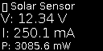

# 🌞 SolarBot — Solar Energy Monitoring System (IoT)

An **IoT-based Solar Energy Monitoring System** powered by the **NodeMCU ESP8266**, **INA219 sensor**, and **0.96″ SSD1306 OLED Display**, featuring real-time monitoring and **Telegram Bot integration** for remote control and data access.

---

## 🖼️ OLED Preview

### 🔆 Startup Screen


### ⚡ Monitoring Screen


---

## ⚙️ Features

✅ Real-time measurement of:
- Voltage (V)
- Current (mA)
- Power (mW)

✅ OLED Display:
- Displays live sensor readings  
- “☀ SolarBot” startup splash animation  
- Auto-refreshing UI with clock and status view  

✅ Telegram Bot Integration:
- `/voltage` → Display voltage value  
- `/current` → Display current value  
- `/power` → Display power value  
- `/status` → Show all readings  

✅ Shared I²C bus (OLED + INA219 on SDA/SCL)

✅ Compact design for portable or embedded solar systems

---

## 🧰 Hardware Components

| Component | Description |
|------------|-------------|
| NodeMCU ESP8266 | Wi-Fi-enabled microcontroller board |
| INA219 | Voltage, current, and power sensor |
| 0.96″ OLED Display (SSD1306) | I²C display for real-time data |
| Solar Panel | Power source |
| Jumper Wires | For module connections |

---

## 🪜 Wiring Diagram (I²C Connections)

| Component | SDA | SCL | VCC | GND |
|------------|-----|-----|-----|-----|
| OLED Display | D6 (GPIO14) | D5 (GPIO12) | 3.3V | GND |
| INA219 Sensor | D2 (GPIO4) | D1 (GPIO5) | 3.3V | GND |

🧩 *Both OLED and INA219 share the same I²C bus. so need to rewiring (D6 & D1) & (D5 & D2)*

---

## 📁 Folder Structure

SolarBot_GitHub/
├── SolarBot.ino # Main program (Wi-Fi + Telegram)
├── oled.ino # OLED display & splash screen logic
├── multimeter.ino # INA219 sensor readings
├── images.h # Wi-Fi & gear animation frames
├── config.h # Wi-Fi & Telegram configuration
├── solarbot_startup.png # Startup logo preview
├── solarbot_monitor.png # Monitoring screen preview
└── README.md # Project documentation


---

## 🔧 Software Requirements

- **Arduino IDE 1.8+** or **Arduino CLI**
- **ESP8266 Board Package**
- Required Libraries:
  - `Adafruit INA219`
  - `ESP8266WiFi`
  - `UniversalTelegramBot`
  - `ArduinoJson`
  - `ESP8266 and ESP32 OLED driver for SSD1306 displays`
  - `SSD1306Wire (ThingPulse/esp8266-oled-ssd1306)`
  - `OLEDDisplayUi`

---

## 🚀 Getting Started

1. Open `SolarBot.ino` in Arduino IDE.  
2. Select **NodeMCU 1.0 (ESP-12E Module)** as the board. (If did not have: paste this link at preference (additional board)
'https://dl.espressif.com/dl/package_esp32_index.json, http://arduino.esp8266.com/stable/package_esp8266com_index.json') 
3. Connect your NodeMCU via USB and makesure the port is correct.  
4. Edit `config.h` and add your Wi-Fi and Telegram credentials:
   ```cpp
   #define WIFI_SSID "YourWiFi 2.4GHz only"
   #define WIFI_PASSWORD "YourPassword"
   #define BOT_TOKEN "YourTelegramBotToken"
   
5. Upload the project.
6. Open Serial Monitor (115200 baud) to check Wi-Fi and Telegram status.
7. Watch the OLED boot up with the SolarBot splash animation 🌞

💬 Telegram Commands
Command	Function
/start	Display welcome message and command list
/voltage	Show live voltage value
/current	Show live current value
/power	Show power in mW
/status	Show all readings together
🧠 Example Output
Bus Voltage:   12.34 V
Current:       250.10 mA
Power:         3085.6 mW

👨‍💻 Author

Muhammad Naufal
IoT Developer / Arduino Integration


📜 License

This project is open for educational and academic use.
You may modify or extend it with proper credit.